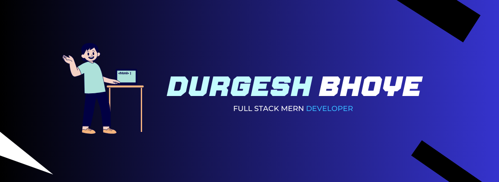

<h1 align="center">
Hi there, I'm <a href="https://www.yushi.dev/" target="_blank" rel="noreferrer">Durgesh</a> 👋
</h1>

 

<h2>
I'm a Full Stack Web Developer 💻!
</h2> 

  

<!-- About Section -->
 # About me
 

 
  
 ✌️ &emsp; Enjoy to do programming and explore new technologies   
 ❤️ &emsp; I love the entire process of developing creative websites.   
 🚫 &emsp; I love the challenge of finding bugs and spending time on solving coding problems.   
 👨🏻‍💻 &emsp; And Learning how people do code.   

## 💼 Technical Skills

#### Frontend

 

#### Backend

#### Databases

#### Tools and Version Control

 

## 🔭 I'm currently working on

- Personal Portfolio Website (React)

 

## 🌱 I'm currently learning

- Advanced JavaScript

 

###  📈 Top languages 

### 🤝 Connect with me:

 
- 💬 If you have any question/feedback, please do not hesitate to reach out to me!

